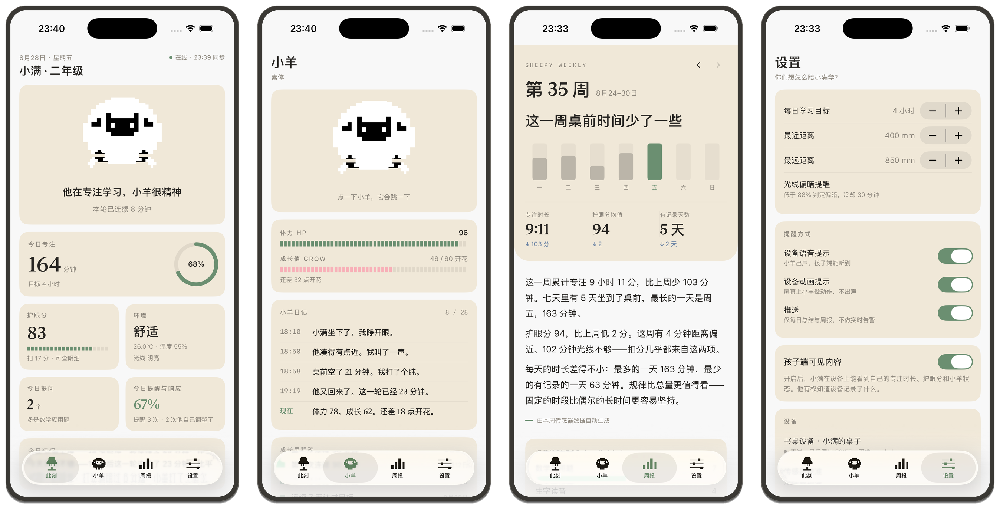
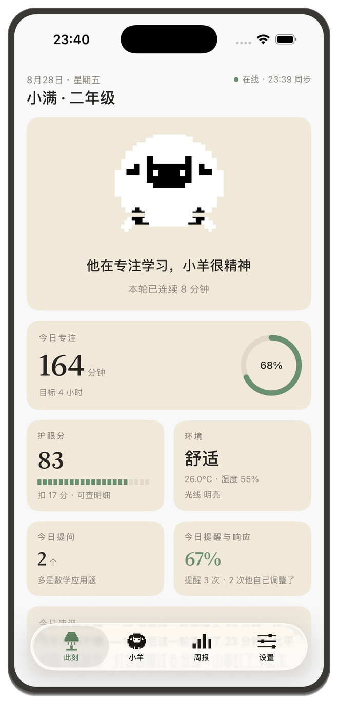
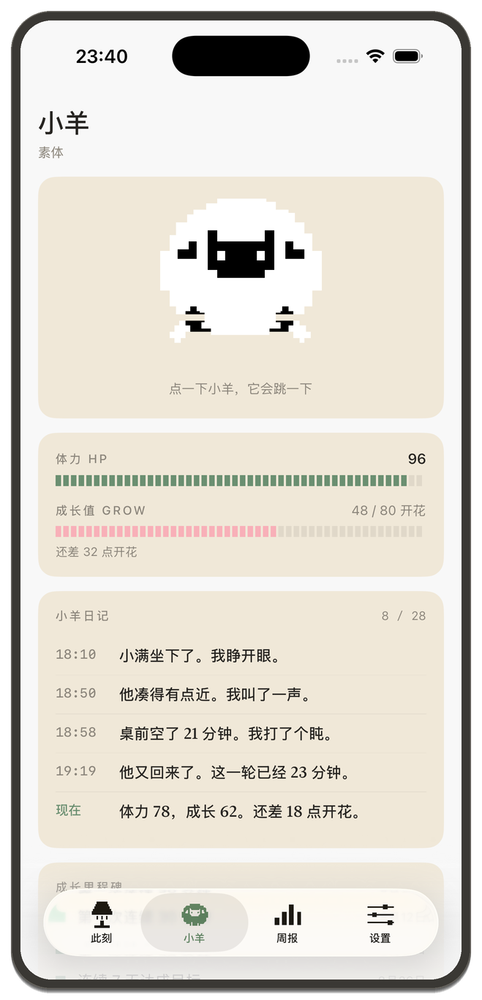
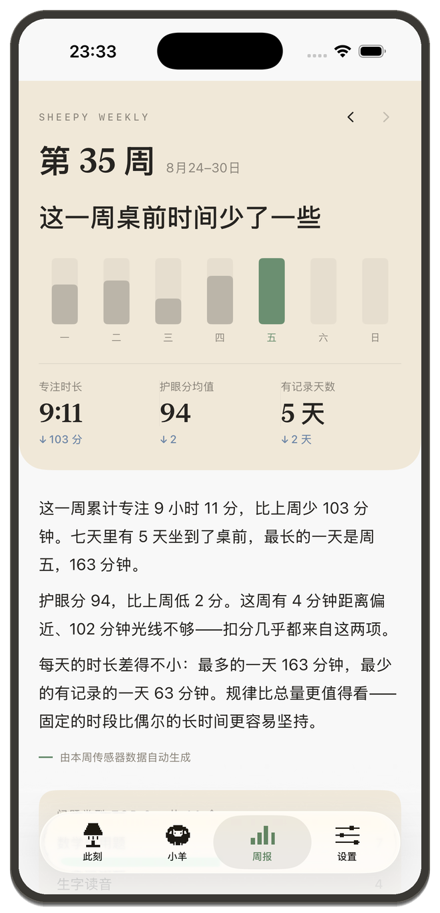
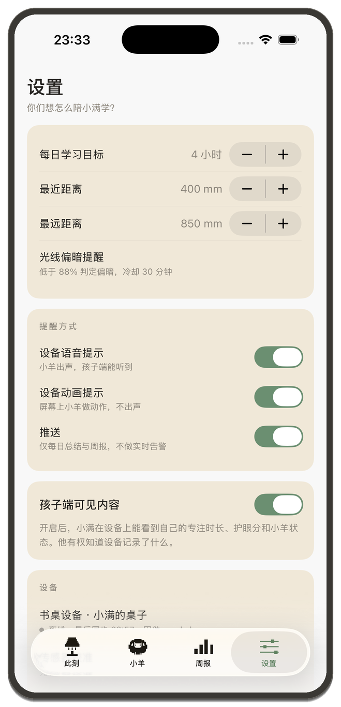
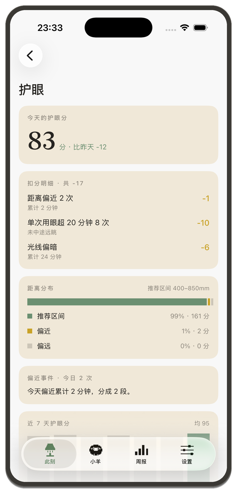
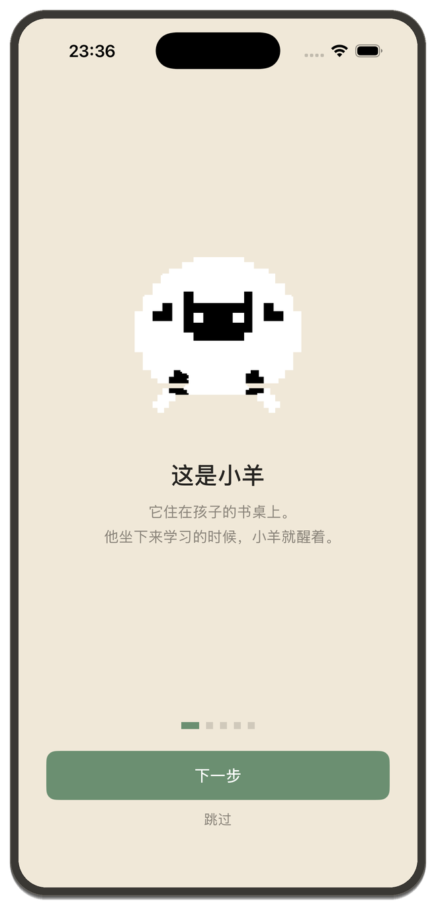

# Sheepy · 书桌学习伴侣

ESP32-S3 桌面设备 + Cloudflare Worker + TiDB Serverless + iOS 家长端。

孩子桌上放一台带屏的小设备，屏幕里住着一只像素小羊。孩子坐下学习，小羊醒着；
凑太近、光线太暗、坐太久，小羊出声提醒。家长在手机上看到的是**同一只羊** ——
不是监控画面，是一起养的一只宠物。



---

## 一、整体链路

```
                    ┌── POST /ingest ─────▶ 上行：传感器样本 + 小羊状态
ESP32-S3 ───────────┤
                    └── GET  /pull ◀────── 下行：配置 + 家长动作（≤20 秒）

                    ┌── GET  /api/* ─────── 快照 / 学习 / 护眼 / 周报 / 设置
iOS App  ───────────┤
                    └── POST /api/settings  写 device_config
                        POST /api/action    喂草 / 奖励
```

**两端都只跟 Worker 说话**，互相不知道对方存在，也都拿不到数据库凭据。
线上地址 `https://sheepy.timoz.me`。

双向都是活的：家长在 App 上改一个阈值或按一次喂草，板子最多 20 秒后生效；
生效后的新数值立刻回推，App 大约 20 秒就能看到。

完整的接线说明、踩过的坑和自检清单：**[`docs/INTEGRATION.md`](docs/INTEGRATION.md)**

---

## 二、各部分在哪

```text
apps/ios/                 家长端 iOS App（SwiftUI，本仓库主要交付物之一）
  Sources/
    Backend.swift         后端地址 / childID —— 硬编码，用户不需要填任何连接信息
    Secrets.swift.example  API_TOKEN 模板（真文件被 gitignore，见第三节）
    Models.swift          全部数据模型；PetForm 是小羊的七种状态
    DataSource.swift      协议 + Mock 源 + HTTP 源 + Store（轮询、写回、发动作）
    Theme.swift           设计令牌（色板、字体、圆角），取自设计稿
    Views/                NowView 此刻 / PetView 小羊 / WeeklyView 周报 / SettingsView 设置
                          EyeView 护眼 / StudyView 学习 / AskView 提问 /
                          EnvView 环境 / RemindersView 提醒 / OnboardingView 引导
  Resources/Assets.xcassets/
    sheep*.imageset       六张小羊母版（透明底）
    anim*.imageset        逐帧动画，取自设备端 LCD 素材
    tab*.imageset         底部导航的定制像素图标
  project.yml             xcodegen 工程定义（.xcodeproj 不进 git）

services/worker/          Cloudflare Worker —— 唯一接触数据库的地方
  src/index.ts            全部路由：/ingest /pull /config /api/*
  src/mock.ts             表里没数据时的回落值，结构与真实响应一致
  wrangler.toml           自定义域名绑定（*.workers.dev 在国内被 DNS 污染）
  README.md               部署步骤

services/api/             等价的 FastAPI 实现（本地开发用，与 Worker 契约一致）
  schema.sql              TiDB 建表语句，8 张表
  features.py             行为向量与相似日检索

firmware/                 ESP32-S3 MicroPython 固件
  main.py                 主程序（板上路径 /main.py）
  net.py                  网络韧性层：断线重连、离线落盘、批量补传、配置下行
                          上报跑在独立线程 —— 一次 TLS 要 7~21 秒，主循环
                          的看门狗只有 8 秒
  sheepy_config.example.py  Wi-Fi 与后端配置模板（真文件被 gitignore）
  pet_growth.py           小羊的体力/成长规则
  voice_qa_client.py      语音问答状态机
  assets/                 PCM 提示音、LCD 动画素材

tooling/
  board.py                串口会话：复位 + 抢占 UART0 + raw REPL
                          （main.py 启动 3 秒后把 GPIO43/44 改成 LCD 的 DC/CS，
                            串口从那一刻起就哑了，所以每次连板都要抢窗口）
  board_uplink_test.py    板端六步自检：Wi-Fi → DNS → NTP → 内存 → 上报 → 下行配置
  seed_demo.py            灌演示数据（带 simulated 标记，不会让设备假装在线）
  demo_heartbeat.py       发一条心跳让 App 显示在线 —— 只给截图用，90 秒自愈
  asset_builders/         Tab 图标、动画帧等资源的生成脚本
  deploy.py / audit_board.py  烧写与板上源码一致性审计

docs/
  INTEGRATION.md          三端接线总说明（先看这个）
  design/
    screens/              各页面截图（带手机框）+ raw/ 原始截图
    TABBAR_ICONS.md       底部四个图标的设计交接与实际执行记录
    tabbar-icons-generated/  生图模型的原始输出与对齐后的成品
    DESIGN_SYSTEM.md      设计系统
    HANDOFF.md            硬件交接
  architecture.md         中文手绘系统架构图与开发边界
  hardware/pinout.md      完整引脚表

apps/landing/             项目落地页
apps/parent_dashboard/    早期家长端 Web 原型
archive/                  历史迭代与回滚快照
```

---

## 三、跑起来

### iOS App

需要先建一个本地机密文件（它被 gitignore，不在仓库里）：

```bash
cp apps/ios/Sources/Secrets.swift.example apps/ios/Sources/Secrets.swift
# 编辑它，填上 Worker 的 API_TOKEN
```

然后：

```bash
cd apps/ios
xcodegen generate
open Sheepy.xcodeproj
```

App 不需要用户填任何连接信息——地址、令牌、`childID` 全在
`Sources/Backend.swift` 里。引导页只问一件因人而异的事：孩子叫什么。

### Worker

```bash
cd services/worker
npm install
npx wrangler secret put DATABASE_URL   # mysql://<用户>:<密码>@<host>:4000/<库>
npx wrangler secret put API_TOKEN      # 自己生成一串，两端共用
npx wrangler deploy
curl https://<你的域名>/health         # 期望 {"ok":true,"db":true,"auth":true}
```

建表：`services/api/schema.sql`。

### 板子

```bash
cp firmware/sheepy_config.example.py firmware/sheepy_config.py
# 填 Wi-Fi 和 API_TOKEN，CHILD_ID 必须和 Backend.swift 里的一致
python3 tooling/board_uplink_test.py    # 六步全绿说明板子这条腿通了
```

### 演示数据

```bash
python3 tooling/seed_demo.py --token "$TOKEN" --days 35
```

灌的数据带 `simulated` 标记，Worker 收到就跳过设备存活的写入——**板子拔了，
App 上就会老实显示离线**。要截"在线"的图，单独发一条心跳：

```bash
python3 tooling/demo_heartbeat.py --token "$TOKEN"
```

---

## 四、页面

| | | |
| --- | --- | --- |
|  |  |  |
| **此刻** 小羊状态、今日专注、护眼分、环境 | **小羊** 体力成长、小羊日记、喂草与奖励 | **周报** 通栏封面、七天柱、往期可翻 |
|  |  |  |
| **设置** 阈值与开关，改完直接下发到板子 | **护眼** 距离分桶、扣分明细、近 7 天 | **引导** 五屏，只问孩子的名字 |

其余页面见 [`docs/design/screens/`](docs/design/screens/)。

---

## 五、数据是真的还是演示的

写在前面，免得演示时说不清：

| 数据 | 来源 |
| --- | --- |
| 小羊状态、今日专注、护眼分、环境、学习分段、周报 | **TiDB 实算**，来自 `sensor_minute` |
| 问题类型 Top 3、今日提问 | **TiDB 实算**，来自 `ask_log` |
| 小羊日记、成长里程碑、首页那句「今日速评」 | 仍是演示数据 |
| 提醒与响应 | `reminder_event` 表，板子还没往里写，所以回落到演示值 |

`sensor_minute` 里混着 `seed_demo.py` 灌的历史和板子的真数据。要一份干净的，
换个 `child_id` 重来即可。

---

## 六、硬件关键引脚

| 功能 | 引脚 |
| --- | --- |
| OLED | SDA IO4 / SCL IO5 |
| LCD | SCK IO21 / MOSI IO47 / DC IO43 / CS IO44 |
| PIR | IO16 |
| VL53L0X | SDA IO17 / SCL IO18 |
| 光敏 | ADC IO6 / IO7 |
| 音量电位器 | ADC IO8（两侧接 3V3/GND） |
| DHT11 | IO15 |
| IO10 按钮 / LED2 | IO10 / IO9 |
| 麦克风 | IO41 / IO42 / IO2 |
| 扬声器 | IO38 / IO39 / IO40 |

完整说明见 [`docs/hardware/pinout.md`](docs/hardware/pinout.md)。

---

## 七、本地语音服务（可选）

拔掉 USB 后，固件、显示、传感器、学习计时、本地提醒和云端上报都由
`/main.py` 自动运行。AI 语音问答另外需要 ESP32 与 Mac 同网，并保持
`services/voice_ai/local_fast_voice_server.py` 运行。

```bash
python3 -m venv .venv
.venv/bin/pip install -r requirements.txt
cp services/voice_ai/.env.example services/voice_ai/.env && chmod 600 services/voice_ai/.env
make PYTHON=.venv/bin/python config     # 生成板端私密配置
make PYTHON=.venv/bin/python server     # 启动语音服务
make PYTHON=.venv/bin/python test       # 固件算法 + 语音服务测试
make PYTHON=.venv/bin/python deploy     # 烧写/更新开发板文件
```

---

## 八、素材

透明背景小羊素材包：[`lulu-sheep-transparent-assets-v1.zip`](releases/lulu-sheep-transparent-assets-v1.zip)
（223 张 PNG + 10 个 GIF，共 337 帧，校验见同名 `.sha256`）。

注意 App 里用的不是这个包 —— 它的转换只移除与画布边缘连通的背景，而小羊的
腿是**开口到画布下边缘的黑色缺口**，会被一起抠掉。App 用的是
`tooling/asset_builders/` 里重建的一版，腿保留完整。
