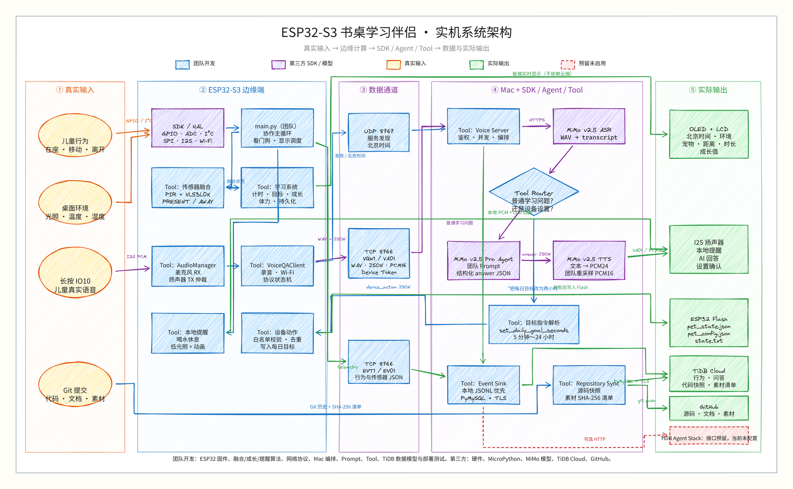
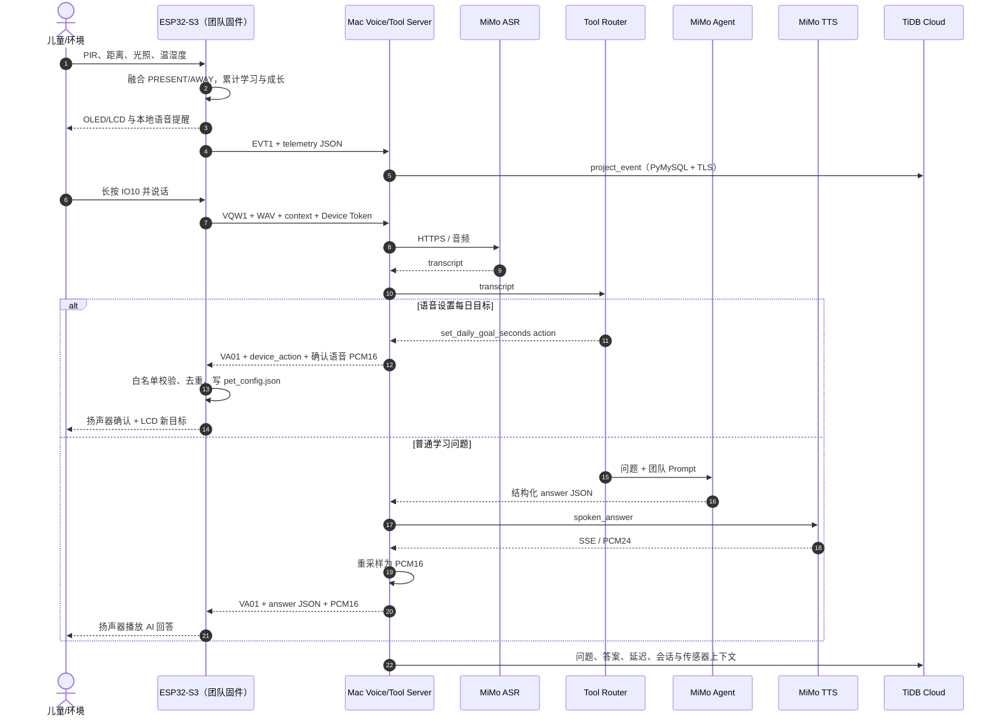

# 书桌学习伴侣系统架构

> 本文描述当前已经跑通并部署到实机的架构。图中“团队开发”表示本项目自行实现或
> 完成工程集成；“第三方”表示现成硬件、运行时或云服务；虚线表示已经预留但当前
> 未启用的链路。

可编辑源文件：
[`desk-study-companion-architecture.excalidraw`](images/desk-study-companion-architecture.excalidraw)

可重复生成源文件的脚本：
[`tooling/generate_architecture_diagram.py`](../tooling/generate_architecture_diagram.py)

## 1. 当前实机架构图

```mermaid
flowchart LR
    subgraph INPUT["① 真实输入"]
        PERSON["儿童在座、移动、离开"]
        ENV["光照、温度、湿度"]
        VOICE["IO10 + 儿童真实语音"]
        REPO["Git 提交、代码与素材"]
    end

    subgraph EDGE["② ESP32-S3 / MicroPython 边缘端"]
        SDK["SDK / HAL（第三方）<br/>GPIO · ADC · I²C · SPI · I2S · Wi-Fi"]
        MAIN["main.py（团队）<br/>协作循环、看门狗、显示调度"]
        FUSION["Tool（团队）<br/>PIR + VL53L0X 融合<br/>PRESENT / AWAY"]
        STUDY["Tool（团队）<br/>学习计时、目标、成长、体力"]
        REMINDER["Tool（团队）<br/>喝水休息 / 低光提醒"]
        AUDIO["Tool（团队）<br/>AudioManager / I2S 仲裁"]
        VCLIENT["Tool（团队）<br/>VoiceQAClient / 录音与协议"]
    end

    LAN["③ Wi-Fi 数据通道（团队协议）<br/>UDP 8767：发现与北京时间<br/>TCP 8766：VQW1/VA01、EVT1/EV01<br/>Device Token"]

    subgraph ORCH["④ Mac 编排 + MiMo 云端"]
        SERVER["Tool（团队）<br/>Voice Server / 鉴权 / 并发"]
        ASR["MiMo v2.5 ASR（第三方）<br/>WAV → transcript"]
        ROUTER{"Tool Router（团队）<br/>问答 or 设置指令"}
        AGENT["Agent（第三方模型）<br/>MiMo v2.5 Pro<br/>团队 Prompt 与 JSON 约束"]
        COMMAND["Tool（团队）<br/>确定性目标指令解析"]
        TTS["MiMo v2.5 TTS（第三方）<br/>文本 → PCM24"]
        RESAMPLE["Tool（团队）<br/>PCM24 → PCM16"]
        SINK["Tool（团队）<br/>Learning Event Sink"]
        SYNC["Tool（团队）<br/>Repository Sync"]
    end

    subgraph OUTPUT["⑤ 实际输出与数据层"]
        SCREEN["OLED + LCD（实机）<br/>北京时间、环境、宠物、距离、时长、成长"]
        SPEAKER["I2S 扬声器（实机）<br/>本地提醒、AI 答案、设置确认"]
        CONFIG["ESP32 Flash（实机）<br/>pet_state.json / pet_config.json / state.txt"]
        JSONL["Mac JSONL（实机）<br/>离线兜底事件队列"]
        TIDB["TiDB Cloud（当前启用）<br/>事件、代码快照、素材清单"]
        STACK["TiDB Agent Stack HTTP<br/>接口预留，当前未配置"]
        GITHUB["GitHub（当前启用）<br/>源码、文档、宠物与音频素材"]
    end

    PERSON -->|"PIR GPIO + 距离 I²C"| SDK
    ENV -->|"双路 ADC + DHT11"| SDK
    VOICE -->|"按钮 GPIO + 麦克风 I2S"| SDK
    SDK --> MAIN
    MAIN --> FUSION
    FUSION --> STUDY
    MAIN --> REMINDER
    MAIN --> AUDIO
    AUDIO --> VCLIENT

    STUDY --> SCREEN
    STUDY --> CONFIG
    REMINDER --> SPEAKER
    VCLIENT -->|"WAV / telemetry"| LAN
    MAIN -->|"心跳 / 状态转换"| LAN
    LAN --> SERVER

    SERVER -->|"HTTPS REST"| ASR
    ASR -->|"transcript"| ROUTER
    ROUTER -->|"普通学习问题"| AGENT
    ROUTER -->|"修改每日目标"| COMMAND
    AGENT -->|"answer JSON"| TTS
    TTS -->|"SSE PCM24"| RESAMPLE
    RESAMPLE -->|"VA01 PCM16，经 ESP32 播放"| SPEAKER
    COMMAND -->|"device_action，经 ESP32 校验写入"| CONFIG

    SERVER --> SINK
    SINK --> JSONL
    SINK -->|"PyMySQL + TLS"| TIDB
    SINK -.->|"可选 HTTP"| STACK
    REPO --> SYNC
    REPO --> GITHUB
    SYNC -->|"PyMySQL + TLS"| TIDB

    classDef team fill:#e8f1ff,stroke:#2563eb,color:#111827,stroke-width:1.5px;
    classDef external fill:#f3f4f6,stroke:#6b7280,color:#111827;
    classDef input fill:#fff7d6,stroke:#ca8a04,color:#111827;
    classDef output fill:#e8f8ef,stroke:#16803c,color:#111827;
    classDef optional fill:#fff1f2,stroke:#be123c,color:#111827,stroke-dasharray:5 4;

    class MAIN,FUSION,STUDY,REMINDER,AUDIO,VCLIENT,LAN,SERVER,ROUTER,COMMAND,RESAMPLE,SINK,SYNC team;
    class SDK,ASR,AGENT,TTS external;
    class PERSON,ENV,VOICE,REPO input;
    class SCREEN,SPEAKER,CONFIG,JSONL,TIDB,GITHUB output;
    class STACK optional;
```

## 2. 端到端数据流

## 3. 系统怎样工作

### 3.1 在座判断、学习计时与宠物成长

1. PIR 提供“人体发生移动”的事件，VL53L0X 提供连续距离。
2. ESP32 的融合状态机使用中位数滤波、进入/离开阈值滞回和确认时间，把原始
   信号转换为稳定的 `PRESENT/AWAY`。
3. `AWAY → PRESENT` 开始本次学习会话；保持 `PRESENT` 时累计连续学习时间和
   当天学习时间；`PRESENT → AWAY` 结束本次会话。
4. 每日成长按“当天累计学习时长 ÷ 可配置目标”逐步发放，完成目标共 `+60`；
   单次连续 45 分钟 `+5`，之后每 30 分钟 `+3`。
5. 状态写入 ESP32 Flash；OLED/LCD 直接由板端刷新，因此拔掉 USB 后仍能工作。

### 3.2 本地提醒

1. 光照过低且人在桌前持续达到确认时间后，板端触发低光提醒。
2. 连续学习达到休息阈值后，板端触发喝水/活动提醒。
3. `AudioManager` 串行管理 I2S 资源，同时播放 PCM 语音和对应 LCD 动画。
4. 这条链路不依赖 Agent；音频素材已存入 ESP32 Flash，局域网断开时仍可工作。

### 3.3 语音问答

1. 儿童长按 IO10，ESP32 通过 I2S 麦克风采集 16 kHz、16-bit、单声道 WAV。
2. ESP32 经 Wi-Fi 使用 `VQW1` 协议把 WAV、设备 ID、Token 和当前传感器上下文
   发给 Mac 服务。
3. Mac 调用 MiMo ASR 得到文字；Tool Router 首先判断它是设备设置指令还是普通
   学习问题。
4. 普通问题交给 MiMo v2.5 Pro Agent；团队编写的 Prompt 要求先给结论、再给最多
   一句关键解释，并返回结构化 JSON。
5. MiMo TTS 生成 24 kHz PCM；Mac 重采样为 16 kHz，通过 `VA01` 回传；ESP32
   扬声器播放答案。

### 3.4 语音修改每日目标

1. 例如说“把每日学习目标设置为两个小时”。
2. ASR 输出文字后，团队开发的确定性 Tool Parser 在 Agent 之前匹配指令，避免
   大模型直接控制硬件。
3. Mac 返回带唯一 ID 的 `set_daily_goal_seconds` 动作。
4. ESP32 去重、校验 5 分钟～24 小时范围后写入 `/pet_config.json`。
5. 新目标立即用于成长比例计算；普通问题不会触发该 Tool。

### 3.5 数据记录

1. ESP32 在开机、PIR 动作、在座切换、会话开始、提醒触发及每分钟心跳时发送
   `EVT1` JSON。
2. Mac 先追加到本地 JSONL，再通过 PyMySQL + TLS 写入 TiDB Cloud。
3. 语音问题、Agent 答案、延迟、学习会话 ID 和传感器上下文写入同一事件表。
4. `tidb-sync` 另行把每个 Git 提交的文本源码写入代码快照表，把二进制素材的
   SHA-256、尺寸、类型和 GitHub 固定提交链接写入素材清单表。
5. TiDB Agent Stack 的 HTTP 转发接口已经预留，但当前环境没有配置 URL；现在
   实际生效的是 TiDB Cloud 直连链路。

## 4. SDK、Agent 与 Tool 的真实边界

| 类型 | 当前组件 | 作用 | 实际状态 | 归属 |
| --- | --- | --- | --- | --- |
| SDK/HAL | MicroPython `machine`、`network`、`framebuf`、I2S | GPIO、ADC、I²C、SPI、音频和 Wi-Fi | 实机运行 | 第三方运行时；团队集成 |
| SDK/API 适配 | `mimo_voice_qa.py`、`fast_voice_pipeline.py` | 调 MiMo OpenAI-compatible REST/SSE API | 实际启用 | 团队开发；MiMo API 第三方 |
| SDK/数据库 | PyMySQL + TLS | 写入 TiDB Cloud | 实际启用 | 第三方驱动；团队封装与建模 |
| Agent | MiMo v2.5 Pro 儿童答疑 Agent | 处理普通学习问题，输出结构化答案 | 实际启用 | 模型第三方；Prompt/约束团队开发 |
| Tool | PIR + VL53L0X 融合 | 原始传感器信号映射为 PRESENT/AWAY | 实机运行 | 团队开发 |
| Tool | 成长与提醒状态机 | 时长、目标、成长、体力、喝水和低光提醒 | 实机运行 | 团队开发 |
| Tool | Voice Command Router | 识别每日目标修改指令，不经过 Agent | 实际启用 | 团队开发 |
| Tool | `set_daily_goal_seconds` | 校验、去重并持久化语音设置 | 实机运行 | 团队开发 |
| Tool | Learning Event Sink | JSONL 兜底、TiDB 写入、可选 Agent Stack 转发 | TiDB 直连启用 | 团队开发 |
| Tool | Repository Sync | 同步源码快照和素材哈希 | 已执行 | 团队开发 |
| 平台 | TiDB Agent Stack HTTP | 未来供 App/Agent 读取和分析事件 | 接口预留，当前未配置 | 第三方平台 |

这里没有让 Agent 直接操作 GPIO、Flash 或数据库。Agent 只负责普通问答；设备设置
由白名单式 Tool Router 和板端校验器执行。

## 5. 真实输入、数据与实际输出

| 阶段 | 真实输入 | 数据格式/通道 | 实际输出 |
| --- | --- | --- | --- |
| 感知 | PIR、距离、两路 ADC、DHT11 | GPIO / I²C / ADC | PRESENT/AWAY、距离、光照、温湿度 |
| 学习 | 在座状态与时间 | ESP32 内存 + JSON Flash | 单次时长、每日累计、成长值、体力值 |
| 语音 | IO10 按钮和儿童语音 | I2S → WAV → Wi-Fi TCP | transcript、Agent 答案、扬声器 PCM |
| 设置 | “目标改为两小时”等语音 | ASR 文本 → device_action JSON | `/pet_config.json` 与 LCD 新目标 |
| 显示 | 板端融合状态 | I²C OLED / SPI LCD | 北京时间、环境、宠物、距离、学习时长 |
| 提醒 | 连续学习或低光事件 | 本地 PCM + RGB565 帧 | 扬声器播报与同步动画 |
| 行为数据 | 快照、心跳、状态转换、问答 | EVT1 JSON → JSONL → TLS SQL | TiDB `project_event` 行 |
| 工程数据 | Git 提交、源码、宠物/音频素材 | Git + SHA-256 + TLS SQL | GitHub 仓库与 TiDB 快照/清单 |

## 6. 哪些部分由团队开发

| 层 | 团队开发内容 | 使用的外部能力 |
| --- | --- | --- |
| 硬件集成 | 引脚映射、接线方案、传感器验证、I²C/SPI/I²S 调试 | ESP32-S3 与各传感器/屏幕模块 |
| ESP32 固件 | 主循环、驱动集成、融合算法、计时、成长、提醒、动画、持久化、看门狗 | MicroPython 运行时 |
| 音频链路 | 按键录音、WAV 处理、I2S 仲裁、PCM 播放、24k→16k 重采样 | I2S 外设、MiMo TTS |
| 网络协议 | VQW1/VA01、EVT1/EV01、UDP 发现、Device Token、重连 | Wi-Fi/TCP/UDP |
| AI 编排 | ASR/Agent/TTS 调度、儿童答疑 Prompt、答案裁剪、语音设置 Router | MiMo 模型与 API |
| 数据层 | 事件模型、SQL 迁移、JSONL 兜底、TiDB 写入、仓库快照工具 | TiDB Cloud、PyMySQL |
| 产品体验 | OLED/LCD 信息架构、宠物成长规则、透明素材、提醒动画与家长端原型 | Pillow、浏览器 |
| 工程交付 | raw REPL、部署、板端审计、自动测试、GitHub Actions | pyserial、esptool、GitHub |

## 7. 当前完成度边界

### 已实际跑通

- 传感器 → ESP32 融合 → OLED/LCD/扬声器。
- ESP32 → Wi-Fi → Mac → MiMo ASR/Agent/TTS → ESP32 扬声器。
- 语音修改每日学习目标并写入 ESP32 Flash。
- ESP32 行为事件 → Mac JSONL → TiDB Cloud。
- GitHub 源码/素材 → TiDB 代码快照与素材清单。

### 仍是接口或原型

- `apps/parent_dashboard` 当前使用本地演示数据，尚未读取实时 TiDB 数据。
- TiDB Agent Stack HTTP 转发代码已具备，但当前 `TIDB_AGENT_STACK_URL` 未配置。
- 蓝牙没有进入当前产品数据通道；拔掉 USB 后主要使用 Wi-Fi。
