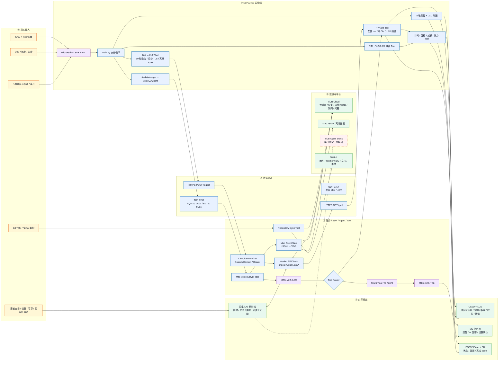
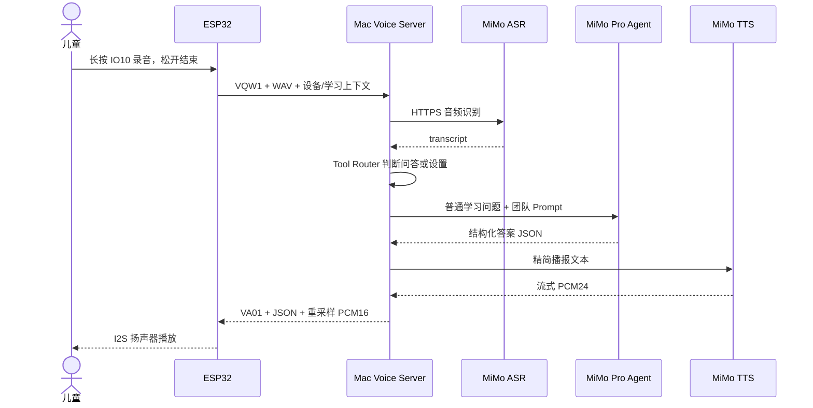
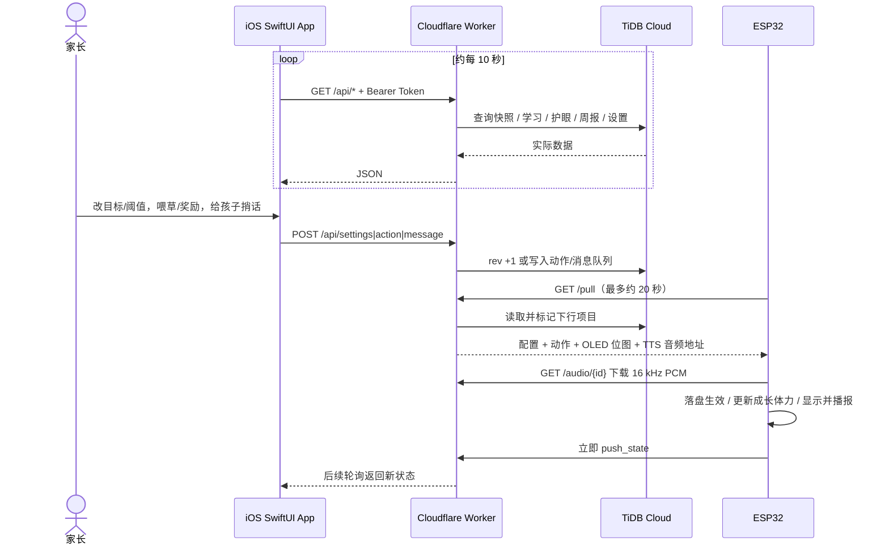

# 书桌学习伴侣系统架构

> 本文按当前 `main` 分支重新核对。图中蓝色表示团队自主开发，紫色表示平台/主办方提供，黄色表示团队配置集成，
> 橙色表示真实输入与控制，绿色表示实际输出或已接通链路，红色虚线表示
> 已预留但尚未接通的能力。2026-08-29 实测线上 Worker
> `/health` 返回 `ok=true`、`db=true`、`auth=true`。

- 可编辑源文件：[`desk-study-companion-architecture.excalidraw`](images/desk-study-companion-architecture.excalidraw)
- 可重复生成脚本：[`tooling/generate_architecture_diagram.py`](../tooling/generate_architecture_diagram.py)
- 板端、Worker 与 iOS 联调细节：[`INTEGRATION.md`](INTEGRATION.md)

## 1. 当前架构

## 2. 五条端到端数据流

### 2.1 板端感知与本地输出

1. PIR、VL53L0X、双路光敏和 DHT11 经 GPIO、I²C、ADC 进入 MicroPython。
2. 融合状态机把“PIR 只能检测变化”和“距离可能短暂丢值”转换为稳定的
   `PRESENT/AWAY`。
3. `PRESENT` 驱动连续学习计时、每日累计、成长和体力；显示、低光提醒和
   休息提醒直接在板端运行。
4. OLED/LCD、扬声器以及 Flash/SD 都不依赖 USB；拔线后仍由 `/main.py`
   自动运行。

### 2.2 儿童语音问答

Mac 通过 UDP 8767 被发现，通过 TCP 8766 承载语音和事件。MiMo 提供模型，
团队实现协议、鉴权、路由、Prompt、答案结构、重采样和板端状态机。

### 2.3 ESP32 云端上报

1. `firmware/net.py` 每 60 秒聚合在座、距离、光照、温湿度、PIR 命中和宠物
   状态。
2. `POST /ingest` 走 HTTPS + Bearer Token。TLS 请求实测可能持续 7～21 秒，
   因此运行在 `_thread` 后台线程，不阻塞显示和 8 秒看门狗。
3. 失败批次先写 SD `/sd/spool`，没有 SD 时写 Flash `/spool`，联网后重放。
4. 时钟优先使用 `ntp.aliyun.com`，NTP 失败则通过 Worker `/time` 对时；上传
   时间统一为 UTC。
5. Worker 使用 `@tidbcloud/serverless` SDK 写入 TiDB。

### 2.4 家长 App 双向控制

App 不直连 TiDB，也不保存数据库凭据。首屏先读取本地真实缓存；无缓存时显示
加载状态，不把 `MockData` 的演示数字冒充实时数据。

### 2.5 工程数据同步

`Repository Sync Tool` 把 Git 版本、文本源码快照和二进制素材 SHA-256 清单
同步到 TiDB；GitHub 保存可构建源码、Worker、原生 iOS App、文档和透明宠物素材。
API Key、Wi-Fi 密码、数据库 URL 和 iOS `Secrets.swift` 不进入仓库。

## 3. 本次根据最新 GitHub 发现的更新

| 新增/变化 | 最新实现 | 架构影响 |
| --- | --- | --- |
| ESP32 云同步 | `firmware/net.py`：重连、60 秒聚合、后台 HTTPS、NTP/Worker 对时、SD/Flash 补传 | 新增 ESP32 → Worker → TiDB 实线主路径 |
| 云端中转层 | `services/worker`：Cloudflare Worker、自定义域名、Bearer、`@tidbcloud/serverless` | 板子与 App 均只连接 Worker，不暴露数据库 |
| 配置与动作下行 | `/pull`、`rev`、`feed`、`reward`、家长消息 OLED 位图 + 云端 TTS | 数据流从单向上报升级为双向闭环 |
| 原生家长端 | `apps/ios`：SwiftUI 1.0、10 秒轮询、本地缓存、设置/互动/捎话 | 静态 Web 原型不再是唯一家长端 |
| 真实数据原则 | App 首屏不展示 Mock 假数字；周报、快照、学习和护眼走实时接口 | 明确区分真实数据和演示模块 |
| 宠物状态细分 | `normal / away / sick / lowLight / restBreak / evolved`，动作态另有 `fed` | App 能区分离座、低光和休息状态 |
| 线上验证 | `https://sheepy.timoz.me/health` 返回 Worker、DB、鉴权均正常 | Worker/TiDB 链路已不是纸面设计 |
| Agent Stack | 图中保留红色虚线 | 仍未进入当前关键路径 |

## 4. SDK、Agent、Tool 与数据边界

| 类型 | 组件 | 作用 | 当前状态 | 归属 |
| --- | --- | --- | --- | --- |
| SDK/HAL | MicroPython `machine`、`network`、`framebuf`、I2S | GPIO、ADC、I²C、SPI、音频、Wi-Fi | 实机使用 | 第三方运行时；团队集成 |
| SDK | `@tidbcloud/serverless` | Worker 访问 TiDB | 线上使用 | 第三方 SDK；团队封装 |
| SDK/API | MiMo OpenAI-compatible REST/SSE | ASR、Agent、TTS | 局域网语音链路使用 | 第三方模型/API；团队编排 |
| Agent | MiMo v2.5 Pro 儿童答疑 Agent | 普通学习问题 → 结构化答案 | 已跑通 | 模型第三方；Prompt/约束团队开发 |
| Tool | 传感器融合 | PIR + 距离 → `PRESENT/AWAY` | 实机运行 | 团队开发 |
| Tool | 学习/成长/提醒 | 计时、目标、成长、体力、提醒和动画 | 实机运行 | 团队开发 |
| Tool | `VoiceQAClient` / `AudioManager` | 非阻塞录音、网络协议、I2S RX/TX 仲裁 | 实机运行 | 团队开发 |
| Tool | `Net` | 云上报、时钟、补传、下行轮询 | 已接入固件 | 团队开发 |
| Tool | Worker API | 鉴权、换算、查询、聚合、配置/动作/消息队列 | 线上运行 | 团队开发 |
| Tool | iOS `APISource` / `Store` | 并发读取、缓存、轮询、设置和互动 | 代码已接通后端 | 团队开发 |
| Tool | Event/Repository Sink | JSONL 兜底、TiDB 事件与代码/素材同步 | 已执行 | 团队开发 |
| 平台 | TiDB Agent Stack | 家长自然语言问数和智能点评 | 接口预留 | 第三方平台 |

Agent 不直接操作 GPIO、Flash 或数据库。所有硬件修改都经确定性 Tool、白名单
字段、范围校验和板端落盘完成。

## 5. 数据层与实际输出

### 5.1 TiDB 主要数据

- `sensor_minute`：60 秒聚合的传感器与在座样本。
- `device`、`child`：设备在线状态和孩子档案。
- `pet_state`：体力、成长和形态。
- `device_config`：每日目标、距离/光照阈值、提醒和显示开关，带 `rev`。
- `device_action`、`device_message`：喂草/奖励和家长捎话下行队列；消息保存 OLED 位图与一次合成的 PCM。
- `study_session`、`ask_log`、`reminder_event`：学习会话、提问和提醒响应模型。

### 5.2 实际输出

| 输出 | 当前内容 |
| --- | --- |
| OLED | 北京时间、环境数据，以及家长捎话的中文位图 |
| LCD | 宠物、PRESENT/AWAY、距离、连续学习时长、动作/提醒动画 |
| 扬声器 | 低光、休息喝水、AI 回答、设置确认和家长捎话 TTS |
| iOS App | 实时快照、学习、护眼、周报、设置、喂草、奖励、给孩子捎话 |
| 本地存储 | 宠物状态、配置、`state.txt`、离线上报 spool |
| 云端 | TiDB 实时数据、聚合报表和双向配置/动作状态 |
| GitHub | 固件、Mac 服务、Worker、iOS App、文档与透明素材 |

## 6. 团队开发范围

| 层 | 团队开发内容 | 外部能力 |
| --- | --- | --- |
| 硬件集成 | 引脚映射、接线、传感器/屏幕/音频验证 | ESP32-S3 与传感器模块 |
| 边缘固件 | 主循环、驱动集成、融合、计时、成长、提醒、动画、持久化、看门狗 | MicroPython |
| 网络协议 | UDP 发现、TCP 语音、HTTPS 聚合上报、离线补传、配置/动作下行 | Wi-Fi、TCP/IP、TLS |
| AI 编排 | ASR/Agent/TTS 调度、儿童 Prompt、答案裁剪、设置 Router | MiMo |
| 云端 | Worker API、鉴权、时区/ADC 换算、实时查询、周报聚合、队列 | Cloudflare Workers、TiDB |
| iOS | SwiftUI 信息架构、真实数据加载、缓存、设置、互动、OLED 位图 | Apple SDK |
| 数据工程 | 表模型、事件落库、代码快照和素材哈希 | TiDB Cloud |
| 工程交付 | raw REPL、部署、板端审计、测试、GitHub Actions、文档 | pyserial、esptool、GitHub |

## 7. 当前完成度边界

### 已接通或已有真实实现

- 传感器 → ESP32 融合 → OLED/LCD/扬声器。
- ESP32 → Mac → MiMo ASR/Agent/TTS → ESP32 扬声器。
- ESP32 `Net` → Cloudflare Worker → TiDB 的上报、对时和离线补传。
- iOS → Worker → TiDB 的实时读取、设置和互动接口。
- Worker → `/pull` → ESP32 的配置、喂草/奖励、OLED 捎话和 TTS 音频下行。
- GitHub 源码/素材与 TiDB 代码快照/素材清单。

### 仍为演示数据、待补生产者或预留

- `/api/diary`、`/api/milestones` 仍返回演示数据。
- `ask_log` 已由语音客户端上报；`reminder_event` 的生产者尚未全部接入，因此提醒卡片仍可能回落到演示内容。
- 家长 AI 自然语言问数、向量检索点评和 TiDB Agent Stack 仍未接入关键路径。
- iOS 版本已升到 1.0，Release/arm64 archive 已通过；仓库具备 TestFlight 上传脚本，但本机无签名证书，尚不等于已经公开发布。
